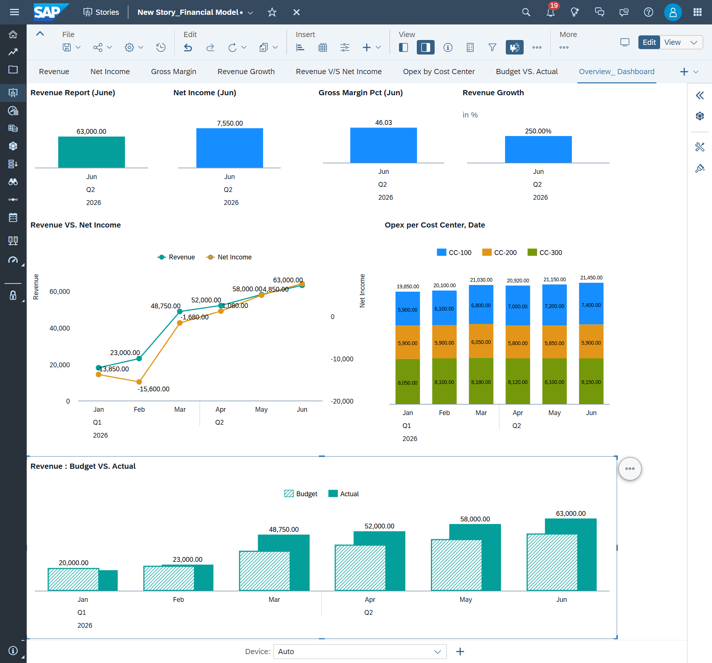
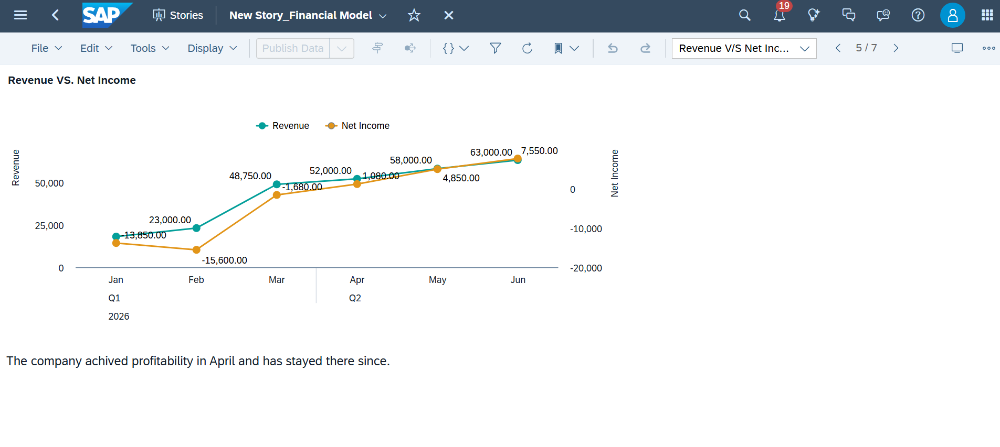
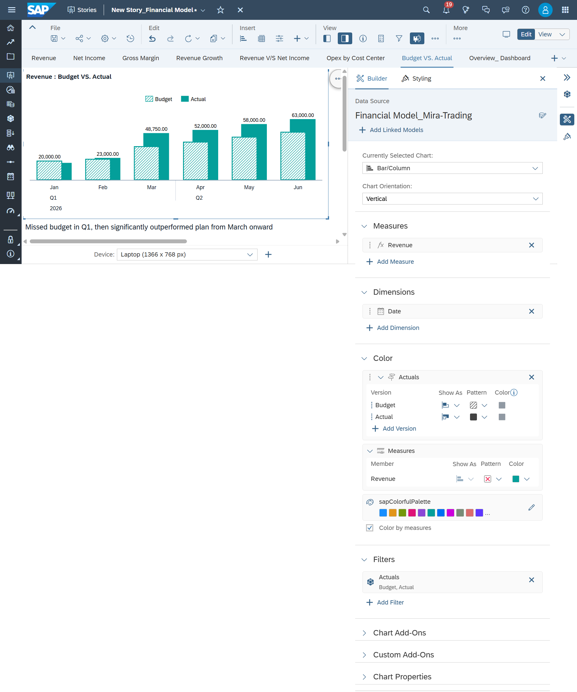
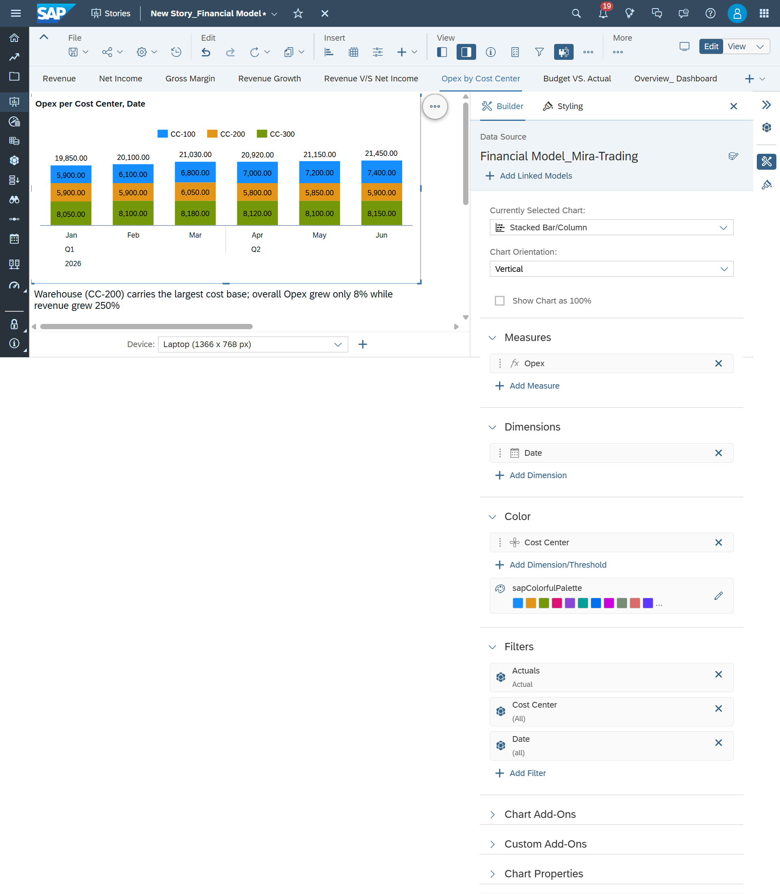

# mira-trading-sap-portfolio
End-to end SAP S/4HANA->BW ->SAC portfolio project
# Case Study: Month-End Close to Management Reporting — Mira Trading Ltd.

*A finance process modeled end-to-end, from transaction posting to a live SAP Analytics Cloud dashboard*

---

## Background

Mira Trading Ltd. is a fictional distribution company I built to demonstrate how a finance close process flows from raw transactions to management reporting — the same process I ran manually for two years as an accountant, now modeled and visualized the way it works across an S/4HANA → BW → SAP Analytics Cloud landscape.

The problem I set out to solve: **a manual month-end close with no unified, visual view of performance, trend, or plan-vs-actual variance.** I built a working, six-month model — not just static screenshots — and a live dashboard on top of it.

---

## A note on tools and methodology

The dashboard (Phase 3) is a fully live build in **SAP Analytics Cloud** — a real model, real calculated measures, real imported data. The finance close (Phase 1) and reporting layer (Phase 2), however, are modeled in **Excel**, standing in for S/4HANA FI/CO and SAP BW respectively.

I made this choice deliberately rather than by necessity alone: it let me focus my limited SAP system access on the layer that matters most for a portfolio — the visible, interactive output — while still designing the upstream logic (double-entry postings, month-end close, cumulative vs. period balances, cost-center aggregation) exactly the way it would need to work if it were sitting in a live S/4HANA and BW landscape. The Excel layer isn't a shortcut around understanding those systems; it's a deliberate simulation of their logic, built so the numbers feeding my SAC dashboard are grounded in a real, auditable close process rather than invented outright.

---

## What I built

**1. Finance close (S/4HANA FI/CO logic)**
A full double-entry general ledger for six months (January–June): chart of accounts, three cost centers (Sales, Warehouse, Admin & Finance), customer invoices, vendor bills, payroll, month-end accruals and depreciation, and partial cash collections/payments to reflect realistic AR/AP aging. Every trial balance ties to zero, every month, with Balance Sheet accounts carried as running cumulative balances and P&L accounts shown as period activity — the same distinction a real monthly close relies on.

**2. Reporting layer (BW-style aggregation)**
A Cost Center × Category query aggregating Revenue, COGS, and Opex across all six months, with Jan→Jun variance — mirroring the extract-model-query flow a BW InfoProvider handles in a live system.

**3. Live dashboard (SAP Analytics Cloud)**
I built and published a working SAC model and story with:
- KPI cards for Revenue, Net Income, Gross Margin %, and Revenue Growth %
- A calculated measure (Net Income) built directly in SAC using RESTRICT logic
- A Revenue vs. Net Income trend line across all six months
- A stacked bar chart of Opex by Cost Center
- A Budget vs. Actual comparison, loaded as a second data version alongside Actuals
- Narrative annotations on each tile



---

## Data Preparation and SAC Build Details

Getting the Excel model into a working dashboard required two things: reshaping the data into a format SAP Analytics Cloud could import, and building calculated logic directly inside SAC rather than relying only on pre-computed Excel numbers.

**1. Reshaping the data for import**

The source Cost Center Reporting sheet stored months across columns (a wide format, easy to read in Excel). SAC's file import instead expects a flat, transactional structure — one row per data point. I unpivoted the sheet into long format: Cost Center, Category, Version, Month, and Amount columns, producing one row per Cost Center × Category × Month combination (54 rows for the Actuals load). This is the same shape a BW extract would hand off in a live system.

**2. Two data loads: Actual and Budget**

Actuals were imported first, mapping Cost Center, Category, Month, and Amount to the model's dimensions and measure, with Version set to "Actual." A second, smaller file (6 rows, Revenue only) was imported afterward under a new "Budget" version, which required creating that version in the model before it could be mapped, since SAC will not import transaction data into a version that does not yet exist. Loading Budget as a genuine second version — rather than hardcoding two sets of numbers into one chart — is what allows the Budget vs. Actual tile to be a real planning-model comparison rather than a static visual.

**3. Calculated measures built in SAC**

- **Net Income** —
  ```
  RESTRICT([Amount],[d/Category]="Revenue") - RESTRICT([Amount],[d/Category]="COGS") - RESTRICT([Amount],[d/Category]="Opex")
  ```
  a measure that did not exist in the raw import and is calculated live inside the model.

- **Gross Margin %** —
  ```
  (RESTRICT([Amount],[d/Category]="Revenue") - RESTRICT([Amount],[d/Category]="COGS")) / RESTRICT([Amount],[d/Category]="Revenue") * 100
  ```

- **Restricted measures for chart series** — separate Revenue-only and Opex-only restricted measures were created so the trend line and stacked bar chart could isolate a single category per series without disturbing how Net Income or Gross Margin % were calculated elsewhere on the same page.

- **Revenue Growth %** — rather than a hand-written formula, this was built using SAC's native "Difference From" story calculation, comparing June directly against January. This was a deliberate, pragmatic choice: a manual multi-condition RESTRICT formula proved unreliable in this environment, and the built-in calculation is both simpler and more robust for a period-over-period comparison.

**4. Troubleshooting worth mentioning**

Two issues shaped the final build. First, the Cost Center dimension was initially configured as an Account-type dimension rather than Generic, which forced every chart to require a single mandatory account selection — this was resolved by rebuilding the model with Cost Center correctly typed as Generic. Second, a multi-condition RESTRICT formula (combining a Category and a Date condition in one calculation) computed without error but returned no value at the row level, a known limitation in this environment; switching that specific KPI to SAC's native period-comparison calculation resolved it cleanly. Both issues, and the process of isolating and fixing them, reflect the kind of systematic troubleshooting this type of role requires day to day.

---

## The result

| Metric | January | June | Change |
|---|---|---|---|
| Revenue | 18,000 | 63,000 | +250% |
| Cost of Goods Sold | 12,000 | 34,000 | +183% |
| Gross Margin | 6,000 | 29,000 | +383% |
| Total Opex | 19,850 | 21,450 | +8% |
| **Net Income** | **(13,850)** | **7,550** | **Crossed into profit in April** |

**The story the numbers tell:** revenue growth (+250% over six months) sharply outpaced cost growth (+8% Opex), driving the company from a significant loss in January to consistent profitability from April onward.



Against budget, Actual revenue ran below plan in Q1 but decisively overtook it from March, ending June 26% ahead of the original forecast.



Warehouse (CC-200) carries the largest cost base, tracking closely with COGS as volume scaled.



---

## What this demonstrates

- **Accounting fundamentals applied in a system context** — not just screens, but the actual close process: postings, accruals, depreciation, cash timing, reconciliation.
- **Understanding of the reporting architecture** — how transactional data (FI) becomes structured reporting data (BW-style aggregation) becomes a live, interactive dashboard (SAC), including building calculated measures and a planning-version comparison directly in the tool.
- **Business insight, not just data entry** — able to read variance (both month-over-month and budget-over-actual) and explain what's driving it, cost center by cost center.
- **Persistence through real technical troubleshooting** — debugging dimension modeling issues, calculated measure syntax, and version mapping is itself a demonstration of the kind of problem-solving a working SAP consultant does daily.

